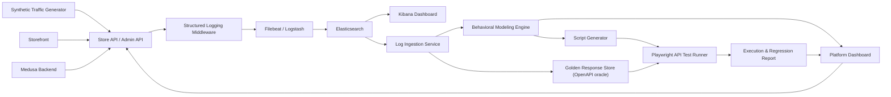

# AI-Driven Behavioral Testing Platform

An AI-driven behavioral **regression** testing platform for Medusa REST APIs.

The platform drives synthetic traffic at a real Medusa e-commerce backend,
captures every request as a structured log, ships those logs through ELK, and
then **mines the raw log stream** to discover how users actually behave. From the
discovered behavior flows it generates executable Playwright API tests, runs them
against Medusa, and compares each response against a golden OpenAPI-derived schema
to produce a red/green regression report.

The two claims that make this "AI-driven" rather than a scripted round-trip:

1. **Emergent persona discovery.** Sessions are *not* labelled with a persona.
   Guest / customer / admin personas fall out of the mined endpoint sequences and
   their response statuses, and are then scored against the held-out JWT
   `user_role` ground truth (precision/recall reported per persona).
2. **Holdout validation.** The registered-customer `register → login → checkout`
   sequence exists **only** in LLM-varied traffic — it is never scripted. The
   behavior engine is expected to rediscover it from statistical co-occurrence,
   reported as a support count, with a negative control proving the engine does
   not hallucinate un-injected flows.

See `docs/architecture.md` for the component/data-flow breakdown,
`docs/pipeline.md` for the exact run order, and `docs/limitations.md` for honest
scope boundaries and future work.

## Architecture



Data flows in one direction: **traffic → logs → Elasticsearch → session flows →
behavior candidates → Playwright specs → run results → report.** The OpenAPI
contract (not logged bodies) is the assertion oracle (ADR 0001). An entity/data-flow
diagram lives at `docs/erd.md`.

## Prerequisites

| Tool | Version | Purpose |
| --- | --- | --- |
| Node.js | 20 or newer | Medusa, TypeScript services, verification scripts |
| npm | 10 or newer | Package management (npm workspaces) |
| Docker | Current stable | PostgreSQL, Redis, Medusa, ELK |
| Docker Compose | `docker-compose` available | Local multi-service startup |
| `ANTHROPIC_API_KEY` | — | LLM-varied traffic (Haiku 4.5) + flow naming/anomaly/assertions (Sonnet 4.6). Mining and classification are deterministic and do **not** need a key. |

### Ports

| Service | Port | Start command |
| --- | --- | --- |
| Medusa | 9000 | `npm run compose:up` |
| Elasticsearch | 9200 | `npm run elk:up` |
| Kibana | 5601 | `npm run elk:up` |
| Logstash | 5044 | `npm run elk:up` |
| PostgreSQL | 5432 | `npm run compose:up` |
| Redis | 6379 | `npm run compose:up` |
| Storefront | 8000 | `npm run storefront:dev` |
| Platform dashboard | 5173 | `npm run dashboard:dev` |

## Quickstart (clean checkout → green report)

Each stage has one command. Run them in order. The detailed, per-step runbook
(with expected output and acceptance gates) is in `docs/pipeline.md`.

```bash
# 0. Install root + service deps
npm install
npm install --prefix apps/medusa
npm install --prefix apps/storefront
npm install --prefix apps/platform-dashboard
cp .env.example .env            # set ANTHROPIC_API_KEY for LLM-varied traffic

# 1. Start Medusa + Postgres + Redis, then seed
npm run compose:up
npm run medusa:setup            # seed products/regions/keys + admin user
docker-compose restart medusa   # pick up seeded schema

# 2. Start ELK, then create the Kibana behavior-logs-* data view (one-time, in the UI)
npm run elk:up

# 3. Generate synthetic traffic against Medusa
npm run traffic:generate

# 4. Ingest logs from Elasticsearch into session flows + golden candidates
npm run ingest:run

# 5. Mine behavior flows + emergent personas (writes test candidates + validation report)
npm run behavior:mine

# 6. Generate Playwright API tests from the candidates
npm run script-generator:generate

# 7. Execute the generated suite against Medusa (writes reports/report.{json,html})
npm run test:all

# 8. (Optional) Triage any failures — advisory root-cause verdicts as a sidecar
npm run triage

# 9. Read the report
open reports/report.html
```

### Regression triage (advisory)

`npm run triage` reads the latest `reports/report.json` (attribution) and
`reports/playwright/normalized.json` (detailed golden diff + captured response
bodies) and classifies each failure — **real regression / contract drift / test
artifact / uncertain** — with a rationale and recommended action. Output is a
**sidecar** `reports/triage.json`, merged into `report.html` as a per-failure
verdict chip. It is strictly advisory: it never touches `report.json`, the
golden oracle, or the gate (ADR 0001/0005), so the regression demo stays
byte-stable. With no `ANTHROPIC_API_KEY` it runs a deterministic heuristic; with
a key it uses Sonnet 4.6 (configurable via `TRIAGE_LLM_MODEL`, e.g.
`claude-opus-4-8`), degrading to the heuristic on any error.

To see a regression caught end to end, run the regression demo: restart Medusa with
`REGRESSION_DEMO=carts_complete_500`, re-run `npm run test:customer`, watch the
report go red with persona/flow/endpoint attribution, then unset the toggle and
re-run to return to green. See the regression-demo section of `docs/pipeline.md`.

## The AI claim, briefly

The "AI-driven" title is backed by measured numbers, not assertion. After
`npm run behavior:mine`, the behavior engine writes a **classification/holdout/
negative-control validation report** alongside the test candidates:

- **Emergent classification accuracy** — per-persona precision/recall of the
  derived persona attribute vs. the held-out JWT `user_role` (two rule variants:
  explicit-endpoint only, and with the auth-gated cart signal).
- **Holdout recovery** — the support count at which PrefixSpan rediscovers the
  registered-customer checkout sequence that exists only in LLM-varied traffic.
- **Negative control** — confirmation that no un-injected flow (e.g. a successful
  `POST /store/returns`, or an admin→customer-checkout chimera) is reported as
  high-support.

Where the LLM is and is **not** used: Haiku 4.5 generates LLM-varied traffic
narratives; Sonnet 4.6 (configurable to Opus 4.8 via `BEHAVIOR_LLM_MODEL`) names
flows, flags anomalies/contamination, and recommends assertions. The LLM is
**never** on the classification, oracle, or gate path — those are deterministic
(ADR 0001, ADR 0005, plan §10.3).

## Repository layout

```text
apps/
  medusa/              Medusa backend (system under test) + logging middleware
  storefront/          Next.js customer-facing storefront
  platform-dashboard/  Internal ops dashboard
services/
  traffic-generator/   Synthetic traffic generator
  log-ingestion/       Elasticsearch → session-flow + golden candidate extraction
  behavior-engine/     n-gram/PrefixSpan mining + emergent persona classification
  golden/              OpenAPI overlay + golden comparison oracle
  script-generator/    Playwright test generation
  test-runner/         Test execution + reporting + regression demo
context/               Project-level specs (plan.md, checklist.md, problem-statement.md)
docs/                  architecture.md, pipeline.md, limitations.md, erd.md
generated-tests/       Emitted Playwright specs (per persona)
golden-responses/      Golden schema snapshots
reports/               report.json + report.html
infra/ scripts/        Infra config + root automation scripts
```

Each service's source is headed by a module-level doc comment describing its
contract — read it before the implementation.

## Verification

Every service ships an **offline** check script that proves its logic without the
live stack (mining, golden comparison, report build, and the regression
detection/attribution all run against committed fixtures):

```bash
npm run check:phase0    # project setup            npm run check:phase7   # behavioral modeling
npm run check:phase1    # Medusa API + seed        npm run check:phase8   # golden / OAS oracle
npm run check:phase2    # logging middleware       npm run check:phase9   # script generator
npm run check:phase3    # ELK ingestion            npm run check:phase10  # test execution
npm run check:phase4    # log schema + Kibana      npm run check:phase11  # reporting
npm run check:phase5    # traffic generator        npm run check:phase12  # regression demo
npm run check:phase6    # log ingestion            npm run check:phase14  # offline sign-off chain
npm run check:triage    # regression triage agent  npm run check:phase15  # HITL review dashboard

# Traffic generator must always compile clean (hard gate):
cd services/traffic-generator && npx tsc --noEmit
```

`npm run check:phase14` chains the fixture-backed sign-off in order; the
live-stack probes are excluded and run only during the full clean run. The
**live** end-to-end validation procedure (clean Docker state → traffic → Kibana
→ green report → regression → revert) is documented in `docs/pipeline.md`.

## Detailed setup, API examples, and troubleshooting

The clean-checkout runbook, stage-by-stage commands with acceptance gates, the
regression demo, and troubleshooting are in `docs/pipeline.md`. Quick references:

- **Medusa health:** `http://localhost:9000/health`
- **Medusa Admin UI:** `http://localhost:9000/app` (`admin@example.com` / `change-me`)
- **Store API:** `http://localhost:9000/store/products` (needs `x-publishable-api-key`)
- **Admin API:** `http://localhost:9000/admin/products` (needs `Authorization: Bearer <token>` from `POST /auth/user/emailpass`)
- **Structured logs:** `logs/medusa-json.log` (JSON lines, bodies-off by default)

### Known limitations

Synthetic traffic is not real production data (mitigated by mixed sources +
holdout); mining is classical n-gram/PrefixSpan, not deep ML; golden snapshots
are shape/type level, not value level; ELK is single-node and memory-bound on a
laptop. Full detail and the future-work roadmap are in `docs/limitations.md`.
