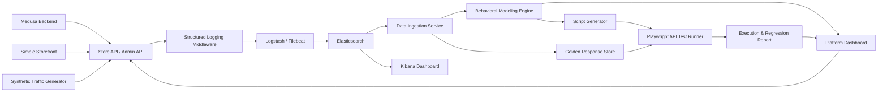

# Project Plan

## 1. Project Title

**AI-Driven Behavioral Testing Platform**

## 2. Selected Approach

This project will use **Medusa** as the main backend system under test.

Medusa is an open-source e-commerce platform with a TypeScript/Node.js backend and REST APIs for both storefront and admin operations. Using Medusa avoids building a demo backend from scratch while still providing realistic e-commerce behavior for guest users, registered customers, and administrators.

References:

- GitHub: https://github.com/medusajs/medusa
- Store API docs: https://docs.medusajs.com/api/store
- Admin API docs: https://docs.medusajs.com/api/admin

## 3. Goal

Build a platform that can:

- Run Medusa as the target REST API backend.
- Generate synthetic user behavior for guest, customer, and admin personas.
- Capture structured access logs and application logs.
- Send logs to Elasticsearch/Kibana.
- Analyze logs to discover user behavior sequences.
- Generate Playwright API tests from discovered behavior flows.
- Execute generated tests against Medusa.
- Compare actual responses with golden responses extracted from logs.
- Produce regression testing reports.

## 4. MVP Scope

The MVP should prove this end-to-end workflow:

```text
Medusa REST API -> Synthetic User Traffic -> Structured Logs -> Elasticsearch
-> Behavioral Analysis -> Generated Playwright Tests -> Execution -> Report
```

For the MVP, the AI engine can start with rule-based analysis and simple sequence mining. LLM support can be added later for flow naming, persona summaries, and assertion recommendations.

## 5. High-Level Architecture



## 6. System Under Test: Medusa

### 6.1 Why Medusa

Medusa is a strong fit because:

- The backend is TypeScript/Node.js.
- It exposes REST APIs, separated into Store APIs and Admin APIs.
- It provides realistic e-commerce entities: products, carts, customers, orders, payments, and admin operations.
- It has admin dashboard support.
- It can be extended with custom middleware and API routes.
- It fits naturally with TypeScript-based Playwright API testing.
- It is a large, well-known open-source project, which makes the thesis/demo more realistic.

### 6.2 API Areas To Use

Regions and Products:

- `GET /store/regions`
- `GET /store/products`
- `GET /store/products/{id}`

Authentication:

- `POST /auth/customer/emailpass/register`
- `POST /auth/customer/emailpass`
- `POST /auth/user/emailpass`

Customers:

- `POST /store/customers`
- `GET /store/customers/me`

Carts and Line Items:

- `POST /store/carts`
- `GET /store/carts/{id}`
- `POST /store/carts/{id}` (update address or promo code)
- `POST /store/carts/{id}/line-items`
- `POST /store/carts/{id}/line-items/{lineItemId}` (update quantity)
- `DELETE /store/carts/{id}/line-items/{lineItemId}`

Checkout:

- `GET /store/shipping-options?cart_id={id}`
- `GET /store/payment-providers?region_id={id}`
- `POST /store/carts/{id}/shipping-methods`
- `POST /store/payment-collections`
- `POST /store/payment-collections/{id}/payment-sessions`
- `POST /store/carts/{id}/complete`

Orders:

- `GET /store/orders`
- `GET /store/orders/{id}`

Admin APIs:

- `POST /auth/user/emailpass`
- `GET /admin/products`

### 6.3 User Personas

`guest_shopper`:

- Load regions.
- Browse products.
- View product details.
- Create a cart.
- Add, update, and remove line items.
- Apply a promo code.
- Select a shipping method.
- Create a payment session.
- Complete checkout as a guest.
- View a specific order by ID.
- Edge cases: call Store APIs without a publishable API key, add a non-existing product variant, complete checkout with an empty cart, send payloads with missing required fields.

`registered_customer`:

- Register an account.
- Log in.
- Load customer profile.
- Browse products and create a cart.
- Add items to cart and complete checkout.
- View order history.
- View a specific order.
- Edge cases: register with a duplicate email, log in with an invalid password, access customer profile without a token.

`admin_operator`:

- Log in as admin.
- List products.
- Manage products, customers, and orders.
- View or update store configuration.
- Edge cases: call Admin APIs without a token, call Admin APIs with an invalid token.

## 7. Logging And ELK Integration

### 7.1 Logging Goal

Add structured logging to Medusa so that every relevant request can be analyzed as user behavior.

Each request log should contain:

```json
{
  "timestamp": "2026-06-09T10:00:00Z",
  "trace_id": "trace-123",
  "session_id": "session-abc",
  "user_role": "customer",
  "user_id": "cus_123",
  "method": "POST",
  "endpoint": "/store/carts",
  "normalized_endpoint": "/store/carts",
  "request_payload": {},
  "response_code": 200,
  "response_body": {},
  "duration_ms": 85,
  "source": "medusa"
}
```

### 7.2 Integration Approach

MVP approach:

- Add logging middleware to the Medusa app.
- Generate a `trace_id` for each request if it does not already exist.
- Attach `session_id` from a cookie or custom header.
- Extract `user_role` from the JWT `actor_type` in the auth context (`null` for unauthenticated guests).
- Log structured JSON lines to stdout or a log file.
- Use Filebeat or Logstash to send logs to Elasticsearch.
- Use Kibana to inspect and search logs by persona, session, trace, endpoint, and response code.

Pipeline:

```text
Medusa JSON Logs -> Filebeat/Logstash -> Elasticsearch -> Kibana
```

### 7.3 Elasticsearch Index

Suggested index pattern:

```text
behavior-logs-*
```

Suggested mapping priorities:

- `timestamp`: date
- `trace_id`: keyword
- `session_id`: keyword
- `user_role`: keyword
- `method`: keyword
- `endpoint`: keyword
- `normalized_endpoint`: keyword
- `response_code`: integer
- `duration_ms`: integer
- `request_payload`: object
- `response_body`: object

## 8. Synthetic Traffic Generator

Because there are no real production logs yet, the project needs a traffic generator that calls real Medusa REST APIs.

### 8.1 Known Limitation: Synthetic Data Circularity

Using purely scripted flows creates a circularity problem: if the generator produces clean, deterministic flows and the behavior engine rediscovers exactly those flows, the "AI discovery" is not meaningful — it is just a round-trip through the pipeline.

To address this without real production data, the traffic generator uses three source types mixed together:

| Source | Share | Purpose |
| --- | --- | --- |
| Scripted flows | ~70% | Backbone coverage, all key endpoints exercised |
| LLM-varied flows | ~20% | Realistic diversity the scripts did not anticipate |
| Injected noise | ~10% | Abandoned sessions, retries, persona contamination |

The behavior engine must recover signal from the combined, messy log stream rather than simply matching hardcoded patterns.

### 8.2 LLM-Varied Traffic

For the LLM-varied portion, a Claude API call generates realistic session narratives that are then translated into API sequences. Example prompt:

> You are a realistic e-commerce user interacting with a store API. Given the following available endpoints, generate a plausible sequence of 5 to 15 API calls a real user might make. Vary the order, skip optional steps sometimes, abandon carts, retry after failures, and occasionally browse without buying.

This produces sequences such as:
- Browsing many products without adding to cart.
- Starting registration then abandoning before completing checkout.
- Adding and removing multiple line items before settling on one.
- Viewing an order immediately after placing it.

### 8.3 Noise Injection

Even within scripted sessions, add noise layers:

- **Abandoned flows**: cut 40% of sessions short at a random step before completion.
- **Retries**: after a 4xx response, repeat the same call with corrected or incorrect input.
- **Persona contamination**: a session labeled `guest_shopper` occasionally hits a customer-auth endpoint or vice versa, simulating users who switch between modes.
- **Random interleavings**: product browsing steps are shuffled — a user may view product detail before listing products, or revisit listing after viewing a detail.

### 8.4 Holdout Validation

To demonstrate that the behavior engine performs genuine discovery:

- Scripted flows cover `guest_shopper` and `admin_operator` personas explicitly.
- The `registered_customer` full checkout flow is **only** present in LLM-varied sessions — it is not hardcoded in the scripted flows.
- The behavior engine is run without any prior knowledge of the customer checkout sequence.
- The engine is expected to discover the customer checkout flow from statistical co-occurrence in the combined log data.

This provides a defensible claim: the system rediscovered a flow it was not explicitly programmed to find.

### 8.5 Example Flows

Guest flow (scripted backbone):

```text
GET /store/products
GET /store/products/{id}
POST /store/carts
POST /store/carts/{id}/line-items
POST /store/carts/{id}/complete
```

Customer flow (LLM-varied only — holdout):

```text
POST /store/customers
POST /auth/customer/emailpass
GET /store/products
POST /store/carts
POST /store/carts/{id}/line-items
POST /store/carts/{id}/complete
```

Admin flow (scripted backbone):

```text
POST /auth/user/emailpass
GET /admin/products
POST /admin/products
PUT /admin/products/{id}
GET /admin/orders
GET /admin/customers
```

Edge-case flow (injected noise):

```text
GET /admin/products without token
POST /store/carts/{invalid_id}/line-items
POST /store/carts/{id}/complete with invalid payload
GET /store/products/{invalid_id}
```

## 9. Data Ingestion Service

The Data Ingestion Service reads logs from Elasticsearch and transforms them into behavioral sequences.

Responsibilities:

- Query logs by time range.
- Filter logs where `source = medusa`.
- Group logs by `session_id`.
- Sort requests by `timestamp`.
- Normalize dynamic endpoints, such as `/store/carts/cart_123` into `/store/carts/{id}`.
- Remove noisy endpoints if needed.
- Extract golden responses.
- Save intermediate output as JSON or in a lightweight database.

Example output:

```json
{
  "session_id": "session-guest-001",
  "persona_hint": "guest_shopper",
  "steps": [
    "GET /store/products",
    "GET /store/products/{id}",
    "POST /store/carts",
    "POST /store/carts/{id}/line-items",
    "POST /store/carts/{id}/complete"
  ]
}
```

## 10. AI Engine / Behavioral Modeling

The AI engine analyzes grouped logs and produces test candidates.

### 10.1 MVP Strategy

- Use n-gram sequence mining as the MVP baseline for short local endpoint transitions.
- Use PrefixSpan to discover frequent variable-length behavior flows across sessions.
- Count flow frequency by persona.
- Use rule-based persona classification.
- Use a simple Markov Chain to model transition probabilities between API calls.
- Detect edge cases based on `4xx` and `5xx` responses.
- Prioritize flows based on support, persona coverage, endpoint importance, error coverage, and business importance.

### 10.2 Mining Algorithm Tradeoffs

- N-grams are simple, fast, and easy to explain in a demo, but they use fixed-length windows and can fragment longer user journeys.
- PrefixSpan is better for discovering full behavior flows with optional intermediate steps, but it requires support thresholds and pruning to avoid too many patterns.
- Markov Chains are useful for transition probabilities and anomaly hints, but they are supporting signals rather than the primary test generation algorithm.

### 10.3 Persona Classification Rules

- Requests involving `/admin/*` and user authentication -> `Admin Operator`.
- Requests involving `/store/customers` or customer authentication -> `Registered Customer`.
- Requests involving `/store/carts` without customer authentication -> `Guest Shopper`.
- Sessions with many `4xx` or `5xx` responses -> `Edge Case User`.

### 10.4 Expected Output

```json
{
  "flow_name": "Guest shopper adds product to cart",
  "persona": "Guest Shopper",
  "priority": "high",
  "source_sessions": ["session-guest-001", "session-guest-002"],
  "steps": [
    {
      "method": "GET",
      "endpoint": "/store/products",
      "expected_status": 200
    },
    {
      "method": "POST",
      "endpoint": "/store/carts",
      "expected_status": 200
    },
    {
      "method": "POST",
      "endpoint": "/store/carts/{id}/line-items",
      "expected_status": 200
    }
  ]
}
```

## 11. Golden Response Store

Golden responses are extracted from Medusa logs and used as references during regression testing.

### 11.1 Extraction Algorithm

During the data ingestion phase, for each unique normalized endpoint and response code combination:

1. Collect all matching response bodies from logs.
2. Walk the response JSON tree and classify each leaf value as a type (`string`, `number`, `boolean`, `array`, `object`, `null`).
3. Flag fields that match the dynamic field list below as `ignored`.
4. Build a schema snapshot that records the shape and types of all non-ignored fields.
5. If multiple sessions produced the same endpoint, merge schemas to handle optional fields.
6. Store the schema snapshot as the golden response for that endpoint.

### 11.2 Dynamic Fields to Ignore

The system should not compare full response bodies directly because Medusa responses include dynamic fields:

- `id`
- `created_at`
- `updated_at`
- `deleted_at`
- `metadata`
- `token`
- `cart_id`
- `order_id`
- `trace_id`
- `session_id`

### 11.3 Schema Versioning

Golden responses are versioned by a run timestamp. When a schema changes intentionally (new field, renamed field), the developer re-runs ingestion to update the baseline. A schema change detected in a test run is treated as a regression until the baseline is explicitly refreshed.

### 11.4 Example Golden Response

```json
{
  "endpoint": "POST /store/carts",
  "expected_status": 200,
  "expected_schema": {
    "cart": {
      "id": "string",
      "currency_code": "string",
      "items": "array"
    }
  },
  "ignore_fields": ["id", "created_at", "updated_at"],
  "captured_at": "2026-06-11T10:00:00Z",
  "source_sessions": ["session-guest-001", "session-guest-007"]
}
```

## 12. Script Generator

The Script Generator converts behavioral flows into Playwright API tests.

### 12.1 Deduplication Before Generation

PrefixSpan on hundreds of sessions produces many overlapping flows. Before generating tests, the script generator deduplicates candidates:

- Group flows with identical normalized step sequences — keep only the one with the highest support count.
- Cluster flows that share a common prefix of three or more steps — keep the longest representative.
- For each persona, cap output at ten canonical flows to avoid test suite bloat.

### 12.2 Generation Rules

- Generate `.spec.ts` files.
- Each persona or flow should become a separate test case.
- Use sample payloads from logs.
- Convert dynamic IDs into runtime variables.
- Attach token or publishable API key headers.
- Add status code assertions.
- Add schema assertions or golden response comparisons.

### 12.3 Example Generated Test

```ts
import { test, expect } from "@playwright/test";

test("Guest Shopper - create cart and add item", async ({ request }) => {
  const products = await request.get("/store/products", {
    headers: {
      "x-publishable-api-key": process.env.MEDUSA_PUBLISHABLE_KEY!
    }
  });

  expect(products.status()).toBe(200);
  const productsBody = await products.json();
  const variantId = productsBody.products[0].variants[0].id;

  const cart = await request.post("/store/carts", {
    headers: {
      "x-publishable-api-key": process.env.MEDUSA_PUBLISHABLE_KEY!
    }
  });

  expect(cart.status()).toBe(200);
  const cartBody = await cart.json();

  const addItem = await request.post(`/store/carts/${cartBody.cart.id}/line-items`, {
    headers: {
      "x-publishable-api-key": process.env.MEDUSA_PUBLISHABLE_KEY!
    },
    data: {
      variant_id: variantId,
      quantity: 1
    }
  });

  expect(addItem.status()).toBe(200);
});
```

## 13. Execution And Reporting

The test runner executes generated Playwright tests against the local or staging Medusa instance.

The report should include:

- Total tests executed.
- Passed and failed tests.
- Affected persona.
- Failed flow.
- Endpoint with the most failures.
- Expected status vs actual status.
- Golden response diff.
- Execution time.
- Source session or trace ID that produced the test.

Suggested outputs:

- `reports/report.json`
- `reports/report.html`
- Playwright HTML report
- Console summary

## 14. Suggested Folder Structure

```text
ai-driven-behavioral-testing-platform/
  apps/
    medusa/
    storefront/
    platform-dashboard/
  infra/
    docker-compose.yml
    elasticsearch/
    logstash/
    kibana/
  services/
    traffic-generator/
    log-ingestion/
    behavior-engine/
    script-generator/
    test-runner/
  generated-tests/
  golden-responses/
  reports/
  docs/
  plan.md
  README.md
```

## 15. Proposed Tech Stack

System under test:

- Medusa.
- TypeScript.
- Node.js.
- PostgreSQL.

Logging and ELK:

- Elasticsearch.
- Logstash or Filebeat.
- Kibana.
- JSON structured logs.

Behavioral platform:

- TypeScript for traffic generation, ingestion, and script generation.
- Python as an optional choice for advanced sequence mining or ML.

Test execution:

- Playwright API testing.
- TypeScript.

Containerization:

- Docker Compose for Medusa, PostgreSQL, Redis if needed, Elasticsearch, Logstash/Filebeat, and Kibana.

## 16. Implementation Roadmap

### Phase 1: Initialize Medusa

Tasks:

- Create a Medusa project in `apps/medusa`.
- Configure PostgreSQL and Redis if required.
- Seed products, regions, shipping options, and mock payment settings.
- Create an admin user.
- Obtain a publishable API key for Store APIs.

Deliverable:

- Medusa runs locally.
- Store API and Admin API can be called through REST.

### Phase 2: Add Structured Logging

Tasks:

- Add logging middleware to Medusa.
- Capture request and response metadata.
- Attach `trace_id`, `session_id`, and `persona`.
- Log JSON lines.
- Mask sensitive fields such as passwords and tokens.

Deliverable:

- Each relevant Medusa request produces a structured log event.

### Phase 3: Storefront And Platform Dashboard

Tasks:

- Create a simple shopper storefront in `apps/storefront`.
- Configure the storefront with `MEDUSA_BACKEND_URL` and `MEDUSA_PUBLISHABLE_API_KEY`.
- Let shoppers browse seeded products, view product details, create a cart, add a selected variant, and see basic cart contents.
- Create a simple platform dashboard in `apps/platform-dashboard`.
- Show Medusa backend status, Store API availability, Admin API authentication availability, and links to the Medusa Admin and storefront.
- Add dashboard placeholders for logs, traffic generation, behavior flows, generated tests, and reports.
- Use `http://localhost:8000` for the storefront and `http://localhost:3000` for the dashboard.

Deliverable:

- Demo users can access a shopper UI and project operators can access a platform dashboard.

### Phase 4: Integrate ELK

Tasks:

- Create Docker Compose configuration for Elasticsearch and Kibana.
- Configure Logstash or Filebeat to read Medusa logs.
- Create the `behavior-logs-*` index pattern.
- Confirm logs are searchable in Kibana.

Deliverable:

- Medusa logs are stored in Elasticsearch and visible in Kibana.

### Phase 5: Generate Synthetic Traffic

Tasks:

- Implement traffic generator flows for guest, customer, admin, and edge cases.
- Call real Medusa APIs.
- Attach persona, session, and trace headers.
- Generate enough data, for example 100-500 sessions.

Deliverable:

- Elasticsearch contains rich behavioral logs for analysis.

### Phase 6: Data Ingestion And Preprocessing

Tasks:

- Query logs from Elasticsearch.
- Group logs by `session_id`.
- Sort by `timestamp`.
- Normalize endpoints.
- Create behavioral sequences.
- Extract golden responses.

Deliverable:

- Session flows and golden responses are available for modeling and test generation.

### Phase 7: Behavioral Modeling

Tasks:

- Classify personas.
- Run n-gram mining as a baseline for short endpoint sequences.
- Run PrefixSpan for frequent variable-length behavior flows.
- Identify important edge-case flows.
- Rank mined candidates by support, persona coverage, endpoint importance, error coverage, and business importance.
- Produce test candidates.

Deliverable:

- A list of behavior flows ready for test generation.

### Phase 8: Script Generation

Tasks:

- Generate Playwright API tests.
- Handle tokens, cart IDs, product IDs, and variant IDs.
- Add status code assertions.
- Add schema or golden response comparisons.

Deliverable:

- Generated test suite in `generated-tests/`.

### Phase 9: Execution And Reporting

Tasks:

- Run generated tests.
- Collect results.
- Compare actual responses with golden responses.
- Generate JSON and HTML reports.

Deliverable:

- Complete regression report.

## 17. Acceptance Criteria

The project is considered successful when:

- Medusa runs locally.
- Store API and Admin API are testable.
- A simple storefront is available for shopper-facing demo flows.
- A platform dashboard is available for project status, links, and future pipeline outputs.
- At least three personas are supported: guest, customer, and admin.
- The synthetic traffic generator produces logs.
- Logs include `trace_id`, `session_id`, `persona`, endpoint, payload, and response code.
- Logs are stored in Elasticsearch and visible in Kibana.
- Logs can be grouped by session.
- At least five behavioral flows are discovered.
- At least five Playwright API tests are generated.
- Generated tests can be executed.
- The system can detect regressions when response code or response schema changes.
- JSON and HTML reports are produced.

## 18. Risks And Mitigations

| Risk | Impact | Mitigation |
| --- | --- | --- |
| Medusa setup is more complex than expected | Slower implementation | Start with minimal flows: products, carts, admin products |
| Guest checkout requires payment/shipping setup | Checkout tests may be unstable | Use mock payment/shipping or keep cart flows as MVP |
| Responses contain many dynamic fields | False regression failures | Normalize responses and ignore dynamic fields |
| Response bodies are too large for logs | Elasticsearch becomes heavy | Log reduced bodies or schema snapshots |
| Tokens or passwords may be logged | Security risk | Mask sensitive fields before logging |
| ELK requires significant memory | Local machine may slow down | Use single-node Elasticsearch with memory limits; validate memory headroom before running 500 sessions |
| Generated tests depend on seeded data | Tests may become unstable | Use fixed seed data and resolve IDs at runtime |
| Scripted traffic creates discovery circularity | AI claims are not credible | Use LLM-varied sessions and holdout validation (see Section 8) |
| PrefixSpan on clean data produces too many near-identical flows | Script generator emits redundant tests | Add a deduplication/clustering step before script generation; generate one canonical test per flow cluster |
| Golden response schema extraction is complex on nested Medusa responses | False regressions or missed regressions | Extract schema snapshots at ingestion time; log reduced bodies; define the ignore-fields list explicitly per endpoint |

## 19. Future Enhancements

- Integrate an LLM to name flows and summarize personas.
- Use embeddings to cluster user behavior.
- Add anomaly detection for unusual API sequences.
- Expand the platform dashboard with live flow, persona, and regression analytics.
- Integrate with CI/CD to run generated tests automatically.
- Add OpenTelemetry traces in addition to access logs.
- Add Playwright UI tests for the storefront and platform dashboard.
- Generate tests from both Admin Dashboard behavior and REST API behavior.

## 20. Conclusion

Using Medusa gives the project a realistic e-commerce REST API backend with clear guest, customer, and admin behavior. The main contribution of the project is the AI-driven behavioral testing pipeline: structured logging, ELK ingestion, behavior analysis, automatic test generation, test execution, and regression reporting.

This approach is more realistic than building a toy backend from scratch while still being practical enough for an MVP.
