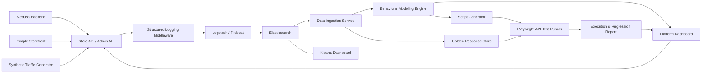

# Project Plan

## 1. Project Title

**AI-Driven Behavioral Testing Platform**

## 2. Selected Approach

This project will use **Medusa** as the main backend system under test.

Medusa is an open-source e-commerce platform with a TypeScript/Node.js backend and REST APIs for both storefront and admin operations. Using Medusa avoids building a demo backend from scratch while still providing realistic e-commerce behavior for guest users, registered customers, and administrators.

References:

- GitHub: https://github.com/medusajs/medusa
- Store API docs: https://docs.medusajs.com/api/store
- Admin API docs: https://docs.medusajs.com/api/admin

## 3. Goal

Build a platform that can:

- Run Medusa as the target REST API backend.
- Generate synthetic user behavior for guest, customer, and admin personas.
- Capture structured access logs and application logs.
- Send logs to Elasticsearch/Kibana.
- Analyze logs to discover user behavior sequences.
- Generate Playwright API tests from discovered behavior flows.
- Execute generated tests against Medusa.
- Compare actual responses with golden responses extracted from logs.
- Produce regression testing reports.

## 4. MVP Scope

The MVP should prove this end-to-end workflow:

```text
Medusa REST API -> Synthetic User Traffic -> Structured Logs -> Elasticsearch
-> Behavioral Analysis -> Generated Playwright Tests -> Execution -> Report
```

For the MVP, the AI engine can start with rule-based analysis and simple sequence mining. LLM support can be added later for flow naming, persona summaries, and assertion recommendations.

## 5. High-Level Architecture



## 6. System Under Test: Medusa

### 6.1 Why Medusa

Medusa is a strong fit because:

- The backend is TypeScript/Node.js.
- It exposes REST APIs, separated into Store APIs and Admin APIs.
- It provides realistic e-commerce entities: products, carts, customers, orders, payments, and admin operations.
- It has admin dashboard support.
- It can be extended with custom middleware and API routes.
- It fits naturally with TypeScript-based Playwright API testing.
- It is a large, well-known open-source project, which makes the thesis/demo more realistic.

### 6.2 API Areas To Use

Regions and Products:

- `GET /store/regions`
- `GET /store/products`
- `GET /store/products/{id}`

Authentication:

- `POST /auth/customer/emailpass/register`
- `POST /auth/customer/emailpass`
- `POST /auth/user/emailpass`

Customers:

- `POST /store/customers`
- `GET /store/customers/me`

Carts and Line Items:

- `POST /store/carts`
- `GET /store/carts/{id}`
- `POST /store/carts/{id}` (update address or promo code)
- `POST /store/carts/{id}/line-items`
- `POST /store/carts/{id}/line-items/{lineItemId}` (update quantity)
- `DELETE /store/carts/{id}/line-items/{lineItemId}`

Checkout:

- `GET /store/shipping-options?cart_id={id}`
- `GET /store/payment-providers?region_id={id}`
- `POST /store/carts/{id}/shipping-methods`
- `POST /store/payment-collections`
- `POST /store/payment-collections/{id}/payment-sessions`
- `POST /store/carts/{id}/complete`

Orders:

- `GET /store/orders`
- `GET /store/orders/{id}`

Admin APIs:

- `POST /auth/user/emailpass`
- `GET /admin/products`

### 6.3 User Personas

`guest_shopper` (browse-only — see note below):

- Load regions.
- Browse products.
- View product details.
- Search and filter the catalog.
- Edge cases: call Store APIs without a publishable API key, view a non-existing product, send payloads with missing required fields, hit a cart/checkout endpoint while unauthenticated (now 401).

> **Guest checkout was removed.** The storefront requires authentication before
> add-to-cart, and the `requireCustomerAuth` middleware 401s every cart/checkout
> mutation (`POST/PATCH/DELETE` on `/store/carts` and `/store/payment-collections`)
> for non-customers. Guests are therefore browse-only; every cart-bearing session
> is a returning or new customer. See ADR 0003 and the Phase 5 plan. This is also
> why the Phase 7 emergent rule treats a *successful* cart mutation as a customer
> signal (§10.3).

`registered_customer` (realized only via LLM-varied traffic — see §8.4):

- Register an account.
- Log in.
- Load customer profile.
- Browse products and create a cart.
- Add items to cart and complete checkout.
- View order history.
- View a specific order.
- Edge cases: register with a duplicate email, log in with an invalid password, access customer profile without a token.

`admin_operator`:

- Log in as admin.
- List products.
- Manage products, customers, and orders.
- View or update store configuration.
- Edge cases: call Admin APIs without a token, call Admin APIs with an invalid token.

## 7. Logging And ELK Integration

### 7.1 Logging Goal

Add structured logging to Medusa so that every relevant request can be analyzed as user behavior.

Each request log should contain:

Logs are **production-shaped hybrid** events (decision: simulate production, not dev access logs): a logical `service` derived from the route, a semantic `event`, and the route (`method` + normalized `endpoint`). Bodies are **off by default** (`LOG_CAPTURE_BODIES=false`, `LOG_ENVIRONMENT=production`).

```json
{
  "timestamp": "2026-06-09T10:00:00Z",
  "level": "INFO",
  "service": "cart-service",
  "environment": "production",
  "request_id": "req-456",
  "trace_id": "trace-123",
  "session_id": "session-abc",
  "user_id": "cus_123",
  "user_role": "customer",
  "event": "cart_created",
  "method": "POST",
  "endpoint": "/store/carts",
  "status": 200,
  "duration_ms": 85,
  "source": "medusa"
}
```

`request_payload` and `response_body` are added only when `LOG_CAPTURE_BODIES=true` (an opt-in dev enrichment). Field renames vs. the original draft: `response_code` → `status`, `normalized_endpoint` → `endpoint`; the semantic `event` and logical `service` are new and carry the behavioral signal alongside the route.

Response-body reduction rule (applies when bodies-on): to keep Elasticsearch light, response bodies are not logged unbounded. Each logged `response_body` is truncated to a maximum of 8 KB; for large arrays, only the first element plus an array-length count is logged; for endpoints known to return large catalogs (for example `GET /store/products`), a schema snapshot is stored instead of full content. The same reduction is applied to `request_payload`. This makes the §18 risk ("response bodies are too large for logs") concrete rather than aspirational.

### 7.2 Integration Approach

MVP approach:

- Add logging middleware to the Medusa app.
- Generate a `trace_id` for each request if it does not already exist.
- Attach `session_id` from a cookie or custom header.
- Extract `user_role` from the JWT `actor_type` in the auth context (`null` for unauthenticated guests).
- Log structured JSON lines to stdout (and a log file for local inspection).
- Collect the container's stdout with **Filebeat** and ship to **Logstash**, which parses the JSON, drops non-Medusa noise, and forwards to Elasticsearch. (Reading stdout, not the bind-mounted file, is robust on Docker Desktop for Windows and is closer to production collection.)
- Use Kibana to inspect and search logs by `user_role`, session, trace, endpoint, and response code (no persona field is logged — persona is emergent, §10.3).

Pipeline:

```text
Medusa stdout (JSON) -> Filebeat -> Logstash -> Elasticsearch -> Kibana
```

### 7.3 Elasticsearch Index

Suggested index pattern:

```text
behavior-logs-*
```

Suggested mapping priorities:

- `timestamp`: date
- `service`: keyword
- `environment`: keyword
- `request_id`: keyword
- `trace_id`: keyword
- `session_id`: keyword
- `user_role`: keyword
- `event`: keyword
- `method`: keyword
- `endpoint`: keyword
- `status`: integer
- `duration_ms`: float
- `request_payload`: flattened (bodies-on only)
- `response_body`: flattened (bodies-on only)

## 8. Synthetic Traffic Generator

Because there are no real production logs yet, the project needs a traffic generator that calls real Medusa REST APIs.

### 8.1 Known Limitation: Synthetic Data Circularity

Using purely scripted flows creates a circularity problem: if the generator produces clean, deterministic flows and the behavior engine rediscovers exactly those flows, the "AI discovery" is not meaningful — it is just a round-trip through the pipeline.

To address this without real production data, the traffic generator uses three source types mixed together:

| Source | Share | Purpose |
| --- | --- | --- |
| Scripted flows | ~70% | Backbone coverage, all key endpoints exercised |
| LLM-varied flows | ~20% | Realistic diversity the scripts did not anticipate |
| Injected noise | ~10% | Abandoned sessions, retries, persona contamination |

The behavior engine must recover signal from the combined, messy log stream rather than simply matching hardcoded patterns.

### 8.2 LLM-Varied Traffic

For the LLM-varied portion, a Claude API call generates realistic session narratives that are then translated into API sequences. Model selection: use Claude Haiku 4.5 (`claude-haiku-4-5-20251001`) for bulk narrative generation given its low cost and latency, and reserve Claude Sonnet 4.6 (`claude-sonnet-4-6`, the shipped default; configurable to Opus 4.8 via `BEHAVIOR_LLM_MODEL`) for the low-volume flow-naming, anomaly-detection, and assertion-recommendation calls described in §10.5. Expected MVP volume is roughly 20–40 narrative generations, well within a few cents of API spend. Example prompt:

> You are a realistic e-commerce user interacting with a store API. Given the following available endpoints, generate a plausible sequence of 5 to 15 API calls a real user might make. Vary the order, skip optional steps sometimes, abandon carts, retry after failures, and occasionally browse without buying.

This produces sequences such as:
- Browsing many products without adding to cart.
- Starting registration then abandoning before completing checkout.
- Adding and removing multiple line items before settling on one.
- Viewing an order immediately after placing it.

### 8.3 Noise Injection

Even within scripted sessions, add noise layers:

- **Abandoned flows**: cut 40% of sessions short at a random step before completion.
- **Retries**: after a 4xx response, repeat the same call with corrected or incorrect input.
- **Persona contamination**: a session labeled `guest_shopper` occasionally hits a customer-auth endpoint or vice versa, simulating users who switch between modes.
- **Random interleavings**: product browsing steps are shuffled — a user may view product detail before listing products, or revisit listing after viewing a detail.

### 8.4 Holdout Validation

To demonstrate that the behavior engine performs genuine discovery:

- Scripted flows cover `guest_shopper` and `admin_operator` personas explicitly.
- The `registered_customer` full checkout flow is **only** present in LLM-varied sessions — it is not hardcoded in the scripted flows.
- The behavior engine is run without any prior knowledge of the customer checkout sequence.
- The engine is expected to discover the customer checkout flow from statistical co-occurrence in the combined log data.

This provides a defensible claim: the system rediscovered a flow it was not explicitly programmed to find.

### 8.5 Example Flows

Guest flow (scripted backbone — browse-only; carts require auth, see §6.3):

```text
GET /store/regions
GET /store/products
GET /store/products/{id}
GET /store/products?q=...      (search / filter)
```

Returning-customer flow (scripted backbone — login or live-JWT reuse, then buy):

```text
POST /auth/customer/emailpass   (omitted on ~55% token-reuse sessions)
GET /store/products
POST /store/carts
POST /store/carts/{id}/line-items
POST /store/carts/{id}/complete
```

Customer flow (LLM-varied only — holdout; the only register→checkout sequence):

```text
POST /store/customers
POST /auth/customer/emailpass
GET /store/products
POST /store/carts
POST /store/carts/{id}/line-items
POST /store/carts/{id}/complete
```

Admin flow (scripted backbone):

```text
POST /auth/user/emailpass
GET /admin/products
POST /admin/products
PUT /admin/products/{id}
GET /admin/orders
GET /admin/customers
```

Edge-case flow (injected noise):

```text
GET /admin/products without token
POST /store/carts/{invalid_id}/line-items
POST /store/carts/{id}/complete with invalid payload
GET /store/products/{invalid_id}
```

## 9. Data Ingestion Service

The Data Ingestion Service reads logs from Elasticsearch and transforms them into behavioral sequences.

Responsibilities:

- Query logs by time range.
- Filter logs where `source = medusa`.
- Group logs by `session_id`.
- Sort requests by `timestamp`.
- Normalize dynamic endpoints, such as `/store/carts/cart_123` into `/store/carts/{id}`.
- Remove noisy endpoints if needed.
- Extract golden responses.
- Save intermediate output as JSON or in a lightweight database.

Example output:

```json
{
  "session_id": "session-guest-001",
  "persona_hint": "guest_shopper",
  "steps": [
    "GET /store/products",
    "GET /store/products/{id}",
    "POST /store/carts",
    "POST /store/carts/{id}/line-items",
    "POST /store/carts/{id}/complete"
  ]
}
```

## 10. AI Engine / Behavioral Modeling

The AI engine analyzes grouped logs and produces test candidates.

### 10.1 MVP Strategy

- Use n-gram sequence mining as the MVP baseline for short local endpoint transitions.
- Use PrefixSpan to discover frequent variable-length behavior flows across sessions.
- Count flow frequency by persona.
- Use rule-based persona classification.
- Use a simple Markov Chain to model transition probabilities between API calls.
- Detect edge cases based on `4xx` and `5xx` responses.
- Prioritize flows based on support, persona coverage, endpoint importance, error coverage, and business importance.

### 10.2 Mining Algorithm Tradeoffs

- N-grams are simple, fast, and easy to explain in a demo, but they use fixed-length windows and can fragment longer user journeys.
- PrefixSpan is better for discovering full behavior flows with optional intermediate steps, but it requires support thresholds and pruning to avoid too many patterns.
- Markov Chains are useful for transition probabilities and anomaly hints, but they are supporting signals rather than the primary test generation algorithm.

### 10.3 Persona As An Emergent Flow Attribute

Personas are not assigned to sessions up front. Instead, flows are mined from the raw, unlabeled sequence stream, and persona is derived deterministically from the endpoint content of each discovered flow:

- `requires_auth: true` if the sequence contains an explicit auth/identity endpoint
  (`/auth/customer/*` or `/store/customers`) **or** a *successful* (2xx) cart or
  checkout mutation (`POST`/`PATCH`/`DELETE` on `/store/carts` or
  `/store/payment-collections`). See "Auth-gated cart signal" below.
- `is_admin: true` if the sequence contains `/admin/*`.
- `has_errors: true` if the sequence contains any `4xx` or `5xx` response.

Personas then fall out of these attributes:

- `is_admin` -> **Admin Operator**.
- `requires_auth` and not `is_admin` -> **Registered Customer**.
- not `requires_auth` and not `is_admin` -> **Guest Shopper**.
- `has_errors` is an orthogonal overlay (an **Edge Case** flag), not a mutually exclusive persona; any flow may also carry it.

For sessions that change role mid-stream — for example a guest who browses and
then signs in and completes checkout — persona is resolved by the highest-privilege
attribute reached in the session (`is_admin` > `requires_auth` > guest).

**Auth-gated cart signal (why the explicit-endpoint rule alone is insufficient).**
Guest checkout was removed: the `requireCustomerAuth` middleware 401s every cart
and checkout mutation for non-customers (ADR 0003, §6.3). Two consequences for
classification:

1. A *successful* cart/checkout mutation can only come from a customer JWT, so it
   is itself a reliable customer signal — endpoint + status derived, never the
   JWT `user_role`. A guest's cart attempt 4xx's and is correctly **not** a
   customer signal (it carries `has_errors` instead).
2. A large share of returning customers reuse a live JWT and emit no `/auth/*`
   endpoint in the session (the cart calls carry the token but the browse calls do
   not), so the explicit-endpoint rule alone would label them guests. Folding the
   successful-cart-mutation signal into `requires_auth` recovers them. How many
   customers this affects is a per-run measurement reported in the Phase 7
   classification report (§10.6), not a constant fixed here — it moves with the
   traffic mix. The cart signal is only valid while the gate enforces (guest cart
   mutations 4xx); the report's endpoint-only-vs-cart-signal delta is what proves it.

Why emergent rather than JWT-assigned: classifying sessions by the JWT `actor_type`
before mining would let a skeptic argue the engine "discovered" nothing — the token
simply told it the role. By separating authenticated from guest behavior from the
sequences alone (endpoints **and** the response statuses that flow from the auth
gate), the system demonstrates genuine discovery. The JWT `user_role` is retained
only as a held-out ground-truth label used to **score** classification accuracy
(see §10.6), never as an input to the classifier.

Note that guest and registered-customer flows share their *browse* prefix
(`regions -> products -> product detail`); the behavioral discriminator is whether
the session ever crosses the auth gate — either by hitting an auth/identity endpoint
or by successfully mutating a cart. That gate is a hard boundary, which is why a
deterministic attribute, not an LLM, is the correct classifier here.

### 10.4 Expected Output

```json
{
  "flow_name": "Guest shopper adds product to cart",
  "persona": "Guest Shopper",
  "priority": "high",
  "source_sessions": ["session-guest-001", "session-guest-002"],
  "steps": [
    {
      "method": "GET",
      "endpoint": "/store/products",
      "expected_status": 200
    },
    {
      "method": "POST",
      "endpoint": "/store/carts",
      "expected_status": 200
    },
    {
      "method": "POST",
      "endpoint": "/store/carts/{id}/line-items",
      "expected_status": 200
    }
  ]
}
```

### 10.5 LLM-Assisted Naming and Anomaly Detection

The mining and classification above are deterministic. The LLM is applied only to tasks that have no deterministic ground truth, which keeps the "AI-driven" claim honest on the output side as well as the input side:

- **Flow naming**: turn a mined step sequence into a human-readable name such as "Guest abandons cart after applying promo."
- **Anomaly / contamination detection**: flag sessions where out-of-persona endpoints appear (for example a guest session that hits a customer-auth endpoint) and judge whether it is contamination or a legitimate guest-to-customer transfer.
- **Assertion recommendation**: suggest which response fields are meaningful to assert for a given flow's golden comparison.

Model selection follows §8.2: Claude Sonnet 4.6 (`claude-sonnet-4-6`, the shipped default; configurable to Opus 4.8 via `BEHAVIOR_LLM_MODEL`) for these low-volume judgment calls. These are MVP features, not future enhancements.

### 10.6 Classification and Discovery Validation

The holdout claim (§8.4) is reported as a measured result, not a binary:

- **Classification accuracy**: compare the emergent persona attribute of each session against the held-out JWT `user_role` ground truth, and report precision/recall per persona.
- **Holdout recovery**: report that PrefixSpan recovers the Registered Customer checkout sequence with support at or above the configured threshold, from N LLM-varied sessions — with a specific support count, not just "present."
- **Negative control**: confirm the engine does **not** report a high-support flow that was never injected, to show discovery is not hallucinated.

## 11. Golden Response Store

Golden responses are used as references during regression testing.

> **Schema source (ADR 0001).** The authoritative assertion oracle is the **OpenAPI contract** (Store + Admin), not logged bodies: it is PII-free, authoritative on status codes, and lets production run bodies-off. The spec schema is **intersected with observed responses** from logs to tighten under-specified fields. The extraction algorithm below describes the *observed half* of that intersection (and the sole source when the spec lacks an operation). Generation stays log-driven; the OAS is the assertion oracle only. See `docs/adr/0001-assertion-oracle-openapi-contract.md` and the Phase 8 plan.
>
> **Spec covers errors + happy path (ADR 0004).** Medusa's generator reads routes/validators, not middleware, so the middleware-injected `requireCustomerAuth` `401` gate is added to the spec by a **deterministic overlay** (`build-oas.ts`) before `oas-source.ts` loads it. (No ADR 0003 fragment is injected — the real Medusa admin base already documents the full reversal surface.) The oracle input is the *augmented* spec; the merge is status-presence check + schema union, **no LLM**.

### 11.1 Extraction Algorithm (observed half of the OAS intersection)

During the data ingestion phase, for each unique normalized endpoint and response code combination:

1. Collect all matching response bodies from logs.
2. Walk the response JSON tree and classify each leaf value as a type (`string`, `number`, `boolean`, `array`, `object`, `null`).
3. Flag fields that match the dynamic field list below as `ignored`.
4. Build a schema snapshot that records the shape and types of all non-ignored fields.
5. If multiple sessions produced the same endpoint, merge schemas to handle optional fields.
6. Store the schema snapshot as the golden response for that endpoint.

### 11.2 Dynamic Fields to Ignore

The system should not compare full response bodies directly because Medusa responses include dynamic fields:

- `id`
- `created_at`
- `updated_at`
- `deleted_at`
- `metadata`
- `token`
- `cart_id`
- `order_id`
- `trace_id`
- `session_id`

### 11.3 Schema Versioning

Golden responses are versioned by a run timestamp. When a schema changes intentionally (new field, renamed field), the developer re-runs ingestion to update the baseline. A schema change detected in a test run is treated as a regression until the baseline is explicitly refreshed.

### 11.4 Example Golden Response

```json
{
  "endpoint": "POST /store/carts",
  "expected_status": 200,
  "expected_schema": {
    "cart": {
      "id": "string",
      "currency_code": "string",
      "items": "array"
    }
  },
  "ignore_fields": ["id", "created_at", "updated_at"],
  "schema_source": "openapi+observed",
  "oas_operation_id": "PostCarts",
  "oas_ref": "#/components/schemas/StoreCart",
  "oas_version": "2.4.0",
  "captured_at": "2026-06-11T10:00:00Z",
  "source_sessions": ["session-guest-001", "session-guest-007"]
}
```

The `schema_source` and `oas_*` provenance fields trace each golden back to the OpenAPI clause it enforces (ADR 0001); they are omitted when a golden falls back to observed-only.

## 12. Script Generator

The Script Generator converts behavioral flows into Playwright API tests.

Note: the problem statement lists "Jest or Mocha" as example API-testing frameworks. This project standardizes on Playwright's request context for API testing instead, so a single runner and report format covers both API and any future UI tests. Playwright API testing supersedes the Jest/Mocha deliverable.

### 12.1 Deduplication Before Generation

PrefixSpan on hundreds of sessions produces many overlapping flows. Before generating tests, the script generator deduplicates candidates:

- Group flows with identical normalized step sequences — keep only the one with the highest support count.
- Cluster flows that share a common prefix of three or more steps — keep the longest representative.
- For each persona, cap output at ten canonical flows to avoid test suite bloat.

### 12.2 Generation Rules

- Generate `.spec.ts` files.
- Each persona or flow should become a separate test case.
- Use sample payloads from logs.
- Convert dynamic IDs into runtime variables.
- Attach token or publishable API key headers.
- Add status code assertions.
- Add schema assertions or golden response comparisons.

### 12.3 Example Generated Test

```ts
import { test, expect } from "@playwright/test";

test("Guest Shopper - create cart and add item", async ({ request }) => {
  const products = await request.get("/store/products", {
    headers: {
      "x-publishable-api-key": process.env.MEDUSA_PUBLISHABLE_KEY!
    }
  });

  expect(products.status()).toBe(200);
  const productsBody = await products.json();
  const variantId = productsBody.products[0].variants[0].id;

  const cart = await request.post("/store/carts", {
    headers: {
      "x-publishable-api-key": process.env.MEDUSA_PUBLISHABLE_KEY!
    }
  });

  expect(cart.status()).toBe(200);
  const cartBody = await cart.json();

  const addItem = await request.post(`/store/carts/${cartBody.cart.id}/line-items`, {
    headers: {
      "x-publishable-api-key": process.env.MEDUSA_PUBLISHABLE_KEY!
    },
    data: {
      variant_id: variantId,
      quantity: 1
    }
  });

  expect(addItem.status()).toBe(200);
});
```

## 13. Execution And Reporting

The test runner executes generated Playwright tests against the local or staging Medusa instance.

The report should include:

- Total tests executed.
- Passed and failed tests.
- Affected persona.
- Failed flow.
- Endpoint with the most failures.
- Expected status vs actual status.
- Golden response diff.
- Execution time.
- Source session or trace ID that produced the test.

Suggested outputs:

- `reports/report.json`
- `reports/report.html`
- Playwright HTML report
- Console summary

## 14. Suggested Folder Structure

```text
ai-driven-behavioral-testing-platform/
  apps/
    medusa/
    storefront/
    platform-dashboard/
  infra/
    docker-compose.yml
    elasticsearch/
    logstash/
    kibana/
  services/
    traffic-generator/
    log-ingestion/
    behavior-engine/
    script-generator/
    test-runner/
  generated-tests/
  golden-responses/
  reports/
  docs/
  plan.md
  README.md
```

## 15. Proposed Tech Stack

System under test:

- Medusa.
- TypeScript.
- Node.js.
- PostgreSQL.

Logging and ELK:

- Elasticsearch.
- Logstash or Filebeat.
- Kibana.
- JSON structured logs.

Behavioral platform:

- TypeScript for traffic generation, ingestion, and script generation.
- Python as an optional choice for advanced sequence mining or ML.
- Claude API (Anthropic SDK): Haiku 4.5 (`claude-haiku-4-5-20251001`) for LLM-varied traffic generation; Sonnet 4.6 (`claude-sonnet-4-6`, the shipped default; configurable to Opus 4.8 via `BEHAVIOR_LLM_MODEL`) for flow naming, anomaly/contamination detection, and assertion recommendation.

Test execution:

- Playwright API testing.
- TypeScript.

Containerization:

- Docker Compose for Medusa, PostgreSQL, Redis if needed, Elasticsearch, Logstash/Filebeat, and Kibana.

## 16. Implementation Roadmap

> **Numbering note.** This roadmap groups the work into ten conceptual stages. The canonical, finer-grained implementation breakdown — used by `context/checklist.md` and `docs/phase-*-implementation-plan.md` — splits these into **Phase 0–15**. Where the two disagree, the docs/checklist numbering is authoritative. Mapping:
>
> | This roadmap | docs / checklist |
> | --- | --- |
> | _(setup, implicit)_ | Phase 0: Project Setup |
> | Phase 1: Initialize Medusa | Phase 1 |
> | Phase 2: Add Structured Logging | Phase 2 (+ Phase 2.1 Docker Compose) |
> | Phase 3: Storefront & Dashboard | Phase 3 |
> | Phase 4: Integrate ELK | Phase 4 |
> | Phase 5: Generate Synthetic Traffic | Phase 5 |
> | Phase 6: Data Ingestion | Phase 6 |
> | Phase 7: Behavioral Modeling | Phase 7 |
> | Phase 8: Script Generation | Phase 8 (Golden Response Handling) + Phase 9 (Script Generator) |
> | Phase 9: Execution & Reporting | Phase 10 (Execution) + Phase 11 (Reporting) + Phase 12 (Regression Demo) |
> | _(reproducibility)_ | Phase 13 (Documentation) + Phase 14 (Final Validation) |
> | Phase 10: HITL Review Dashboard | Phase 15 |

### Phase 1: Initialize Medusa

Tasks:

- Create a Medusa project in `apps/medusa`.
- Configure PostgreSQL and Redis if required.
- Seed products, regions, shipping options, and mock payment settings.
- Create an admin user.
- Obtain a publishable API key for Store APIs.

Deliverable:

- Medusa runs locally.
- Store API and Admin API can be called through REST.

### Phase 2: Add Structured Logging

Tasks:

- Add logging middleware to Medusa.
- Capture request and response metadata.
- Attach `trace_id`, `session_id`, and `user_role` (from the JWT `actor_type`). Do **not** log a persona field — persona is emergent and derived later in Phase 7 (§10.3).
- Log JSON lines.
- Mask sensitive fields such as passwords and tokens.

Deliverable:

- Each relevant Medusa request produces a structured log event.

### Phase 3: Storefront And Platform Dashboard

Tasks:

- Create a simple shopper storefront in `apps/storefront`.
- Configure the storefront with `MEDUSA_BACKEND_URL` and `MEDUSA_PUBLISHABLE_API_KEY`.
- Let shoppers browse seeded products, view product details, create a cart, add a selected variant, and see basic cart contents.
- Create a simple platform dashboard in `apps/platform-dashboard`.
- Show Medusa backend status, Store API availability, Admin API authentication availability, and links to the Medusa Admin and storefront.
- Add dashboard placeholders for logs, traffic generation, behavior flows, generated tests, and reports.
- Use `http://localhost:8000` for the storefront and `http://localhost:5173` for the dashboard.

Deliverable:

- Demo users can access a shopper UI and project operators can access a platform dashboard.

### Phase 4: Integrate ELK

Tasks:

- Create Docker Compose configuration for Elasticsearch and Kibana.
- Configure Logstash or Filebeat to read Medusa logs.
- Create the `behavior-logs-*` index pattern.
- Confirm logs are searchable in Kibana.

Deliverable:

- Medusa logs are stored in Elasticsearch and visible in Kibana.

### Phase 5: Generate Synthetic Traffic

Tasks:

- Implement traffic generator flows for guest, customer, admin, and edge cases.
- Call real Medusa APIs.
- Attach `session_id` and `trace_id` headers only — **no persona header** (see §8 and §10.3; the generator must not label sessions, or the emergent-discovery claim collapses). Run Medusa with `LOG_CAPTURE_BODIES=true` so bodies reach the logs for golden extraction.
- Generate enough data, for example 100-500 sessions.

Deliverable:

- Elasticsearch contains rich behavioral logs for analysis.

### Phase 6: Data Ingestion And Preprocessing

Tasks:

- Query logs from Elasticsearch.
- Group logs by `session_id`.
- Sort by `timestamp`.
- Normalize endpoints.
- Create behavioral sequences.
- Extract golden responses.

Deliverable:

- Session flows and golden responses are available for modeling and test generation.

### Phase 7: Behavioral Modeling

Tasks:

- Classify personas.
- Run n-gram mining as a baseline for short endpoint sequences.
- Run PrefixSpan for frequent variable-length behavior flows.
- Identify important edge-case flows.
- Rank mined candidates by support, persona coverage, endpoint importance, error coverage, and business importance.
- Produce test candidates.

Deliverable:

- A list of behavior flows ready for test generation.

> **Recommended milestone — thin end-to-end slice (after Phase 7).** Most demoable
> value currently lands only at roadmap Phase 9 (execution + regression), ~90% through
> the build. To de-risk the cross-service integration early and give a mid-project
> value checkpoint, ship a **trivial vertical slice** the moment Phase 7 produces
> candidates: hand-generate **one** guest-flow `.spec.ts` (or run the Phase 9
> generator on a single candidate) and execute it against the live backend to a
> green result. This exercises the full candidate → spec → runner → report path on
> one flow before Phases 8–9 deepen it, surfacing wiring/contract problems while they
> are cheap to fix. It is a checkpoint, not a separate deliverable — the real
> generator (docs Phase 9) supersedes the hand-written spec.

### Phase 8: Script Generation (docs Phase 8 Golden Handling + Phase 9 Script Generator)

Tasks:

- Generate Playwright API tests.
- Handle tokens, cart IDs, product IDs, and variant IDs.
- Add status code assertions.
- Add schema or golden response comparisons.

Deliverable:

- Generated test suite in `generated-tests/`.

### Phase 9: Execution And Reporting (docs Phase 10 Execution + Phase 11 Reporting + Phase 12 Regression Demo)

Tasks:

- Run generated tests.
- Collect results.
- Compare actual responses with golden responses.
- Generate JSON and HTML reports.

Deliverable:

- Complete regression report.

### Phase 10: HITL Review Dashboard (docs Phase 15)

A human-in-the-loop review surface over the discovered flows and generated tests. The minimal **read-only review is part of the MVP**; richer controls are optional stretch goals.

MVP tasks (read-only review):

- Extend the platform dashboard with a review view of discovered flows and generated tests.
- Group and filter the list by persona — the read-only derived label from Phase 7. The reviewer never sets persona (see §10.3).
- Show per-test provenance: source `session_id`/`trace_id`, support count, and golden assertions.
- Let a reviewer mark each generated test `approved` or `discarded`, and persist that state in a lightweight JSON store.

Optional (time-permitting, may defer to §19 future work):

- Edit flow steps or assertions in the UI — persona re-derives from the edited steps (see §10.3).
- Gate which tests the runner executes based on approval state.

Deliverable:

- A reviewer can browse discovered flows and generated tests, filter by persona, and mark each test approved or discarded, with the decision persisted. (Editing and execution gating are optional extensions.)

## 17. Acceptance Criteria

The project is considered successful when:

- Medusa runs locally.
- Store API and Admin API are testable.
- A simple storefront is available for shopper-facing demo flows.
- A platform dashboard is available for project status, links, and future pipeline outputs.
- At least three personas are supported: guest, customer, and admin.
- The synthetic traffic generator produces logs.
- Logs include `trace_id`, `session_id`, `user_role`, `endpoint`, and `status` (request/response bodies are emitted only when `LOG_CAPTURE_BODIES=true`; **no** persona field — persona is emergent, §10.3).
- Logs are stored in Elasticsearch and visible in Kibana.
- Logs can be grouped by session.
- At least five behavioral flows are discovered.
- Persona is derived as an emergent flow attribute and validated against JWT `user_role` ground truth with reported precision/recall.
- A negative control confirms no un-injected flow is falsely reported as high-support.
- At least five Playwright API tests are generated.
- Generated tests can be executed.
- The system can detect regressions when response code or response schema changes.
- JSON and HTML reports are produced.
- A reviewer can browse discovered flows and generated tests in the dashboard, filter by persona, and mark each test approved or discarded (read-only HITL review; editing and execution gating are optional extensions).

## 18. Risks And Mitigations

| Risk | Impact | Mitigation |
| --- | --- | --- |
| Medusa setup is more complex than expected | Slower implementation | Start with minimal flows: products, carts, admin products |
| Customer checkout requires payment/shipping setup | Checkout tests may be unstable | Use mock payment/shipping; carts are auth-gated, so checkout runs only for authenticated customers (guest checkout removed, ADR 0003) |
| Responses contain many dynamic fields | False regression failures | Normalize responses and ignore dynamic fields |
| Response bodies are too large for logs | Elasticsearch becomes heavy | Log reduced bodies or schema snapshots |
| Tokens or passwords may be logged | Security risk | Mask sensitive fields before logging |
| ELK requires significant memory | Local machine may slow down | Use single-node Elasticsearch with memory limits; validate memory headroom before running 500 sessions |
| Generated tests depend on seeded data | Tests may become unstable | Use fixed seed data and resolve IDs at runtime |
| Scripted traffic creates discovery circularity | AI claims are not credible | Use LLM-varied sessions and holdout validation (see Section 8) |
| PrefixSpan on clean data produces too many near-identical flows | Script generator emits redundant tests | Add a deduplication/clustering step before script generation; generate one canonical test per flow cluster |
| Golden response schema extraction is complex on nested Medusa responses | False regressions or missed regressions | Extract schema snapshots at ingestion time; log reduced bodies; define the ignore-fields list explicitly per endpoint |

## 19. Future Enhancements

- Use embeddings to cluster user behavior.
- Add anomaly detection for unusual API sequences.
- Expand the platform dashboard with live flow, persona, and regression analytics.
- Integrate with CI/CD to run generated tests automatically.
- Add OpenTelemetry traces in addition to access logs.
- Add Playwright UI tests for the storefront and platform dashboard.
- Generate tests from both Admin Dashboard behavior and REST API behavior.

## 20. Conclusion

Using Medusa gives the project a realistic e-commerce REST API backend with clear guest, customer, and admin behavior. The main contribution of the project is the AI-driven behavioral testing pipeline: structured logging, ELK ingestion, behavior analysis, automatic test generation, test execution, and regression reporting.

This approach is more realistic than building a toy backend from scratch while still being practical enough for an MVP.
