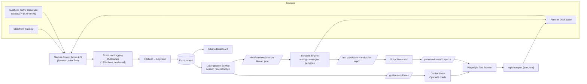

# Architecture

This document describes the components of the AI-Driven Behavioral Testing
Platform, the data that flows between them, and the design decisions that keep the
"AI-driven" claim honest. For the exact run order see
[`pipeline.md`](./pipeline.md); for scope boundaries see
[`limitations.md`](./limitations.md).

## One-paragraph summary

Synthetic traffic is driven at a real Medusa e-commerce backend. Every request is
captured as a structured log line, shipped through ELK into Elasticsearch, and
then **mined** — without persona labels — to discover how users actually behave.
The mined behavior flows are turned into executable Playwright API specs, run back
against Medusa, and each response is compared against an OpenAPI-derived **golden
schema** to produce a red/green regression report. The pipeline is one-directional
and each stage writes a durable artifact the next stage reads.

## Component / data-flow diagram



Data flows in one direction: **traffic → logs → Elasticsearch → session flows →
behavior candidates → Playwright specs → run results → report.**

> **Note on the traffic sources.** The Synthetic Traffic Generator (and the
> storefront/dashboard as ad-hoc sources) are *scaffolding to supply behavioral
> input* — they stand in for the production logs this platform would normally
> consume. They are not features of the product. The platform proper begins at the
> **Structured Logging Middleware** and is source-agnostic from
> `data/sessions/session-flows-*.json` onward: swap the generator for a real log
> shipper and nothing downstream changes.

## Components

| Component | Path | Responsibility |
| --- | --- | --- |
| Medusa backend (SUT) | `apps/medusa/` | The real e-commerce system under test. Hosts Store + Admin REST APIs and the structured logging middleware. |
| Storefront | `apps/storefront/` | Next.js customer-facing app; a real human/traffic source against the Store API. |
| Platform dashboard | `apps/platform-dashboard/` | Internal ops view: mined flows, persona breakdown, run results, and the human-in-the-loop (HITL) review surface. |
| Traffic generator | `services/traffic-generator/` | **Scaffolding, not a product feature.** Stands in for a production log source we don't have — it manufactures the behavioral input the pipeline would otherwise read from a real system. Drives both deterministic scripted flows and **LLM-varied** narratives (Haiku 4.5); the registered-customer checkout backbone exists *only* in the LLM-varied stream. In a real deployment this component is replaced by a log shipper pointed at production/staging Elasticsearch (see [`limitations.md`](./limitations.md) §1). |
| Log ingestion | `services/log-ingestion/` | Reads access/application logs from Elasticsearch, reconstructs per-session journeys, and extracts golden candidates. Writes `data/sessions/session-flows-*.json`. |
| Behavior engine | `services/behavior-engine/` | Mines frequent flows (n-gram / PrefixSpan / Markov), derives personas from attributes, names flows + flags anomalies (LLM), and emits test candidates plus the validation report. |
| Golden store | `services/golden/` | Builds the OpenAPI-derived golden schemas (the assertion oracle) and the comparison logic. |
| Script generator | `services/script-generator/` | Turns test candidates into executable Playwright API specs, per persona. |
| Test runner | `services/test-runner/` | Executes the generated suite against Medusa, compares responses to goldens, and builds `reports/report.{json,html}` with regression attribution. |
| Regression triage agent | `services/test-runner/src/triage/` | **Advisory only.** Post-run, classifies each failure (real regression / contract drift / test artifact / uncertain) from the report + normalized diff + captured body, writing the sidecar `reports/triage.json` and a verdict chip in the HTML. Offline deterministic heuristic with no key; Sonnet 4.6 (→ Opus 4.8) with one. Never on the oracle/gate path (ADR 0001/0005). |

## Data contracts (the artifacts between stages)

The stages are decoupled through files on disk, so any stage can be re-run and
inspected in isolation.

- **Session flow** (`data/sessions/session-flows-*.json`, written by log-ingestion,
  read by the behavior engine). One record per session:

  ```ts
  interface SessionFlow {
    session_id: string;
    started_at: string;
    ended_at: string;
    role_observed: Array<"guest" | "customer" | "admin">; // VALIDATION-ONLY
    steps: FlowStep[];
  }
  interface FlowStep {
    method: string;
    endpoint: string;
    event: string | null;
    status: number;
    trace_id: string | null;
    timestamp: string;
    request_payload: unknown;
    has_error: boolean;
  }
  ```

  `role_observed` is the held-out JWT ground truth. It travels through the file but
  **the mining and classification code never reads it** — see the guardrail below.

- **Test candidates + validation report** (behavior engine output). Candidates are
  ranked, deduplicated mined flows annotated with persona, suggested assertions,
  and anomaly flags. The validation report is the measured-accuracy artifact (see
  "The AI claim, measured").

- **Golden schemas** (golden store). OpenAPI-derived shape/type schemas per
  operation + status, tightened by observed bodies. These are the assertion oracle
  — **not** logged response bodies.

- **Regression report** (`reports/report.{json,html}`). Per-spec pass/fail with
  persona / flow / endpoint attribution.

## The mining engine (the "AI" core)

The behavior engine combines three classical sequence-mining techniques, each
chosen for a different shape of pattern:

- **n-gram** — frequent fixed-length adjacent step pairs/triples (local habits).
- **PrefixSpan** — frequent variable-length *subsequences*, order-preserving with
  gaps allowed. Support is the count of distinct sessions a pattern is a
  subsequence of, against an **absolute floor** (`minSupport = 3`), not a fraction
  of N — this is what lets thin edge-case behavior survive and what recovers full
  journeys (e.g. the registered-customer checkout backbone) through browsing noise.
- **Markov** — transition probabilities between endpoints (next-step likelihood).

Mining is **deterministic** (PO-5): patterns are emitted in a pinned order
(support desc → pattern length desc → lexicographic), so the same input always
yields the same output. Tokens are interned to integers and grown one item at a
time over a projected database of pointers.

### Emergent persona derivation

Personas are **not** read from a label. They are derived from per-flow attributes
(endpoints touched + response statuses), then resolved highest-privilege-wins:

```
is_admin                        -> admin_operator
requires_auth and not is_admin  -> registered_customer
neither                         -> guest_shopper
```

`has_errors` is an orthogonal edge-case overlay, never a competing persona. Every
persona is tagged `persona_source: "emergent_attributes"`.

## The golden oracle

The assertion oracle is the **OpenAPI contract**, not recorded bodies (ADR 0001).
The golden store resolves each operation/status against the *augmented* Store/Admin
OpenAPI spec and tightens under-specified spec leaves with observed shapes
(`schema-merge.tightenWithObserved`); spec-declared fields are never removed by
observation. Where the spec has no entry, it falls back to an observed schema
(`schema_source: "observed"`). A shared, auditable ignore-fields list strips
volatile fields (`id`, timestamps, tokens, `cart_id`, …) so they are not flagged as
regressions.

## Where the LLM is — and is not

| LLM use | Model | Role |
| --- | --- | --- |
| LLM-varied traffic narratives | Haiku 4.5 | Generates realistic, *unscripted* user journeys (the holdout source). |
| Flow naming, anomaly/contamination flagging, assertion recommendations | Sonnet 4.6 (→ Opus 4.8 via `BEHAVIOR_LLM_MODEL`) | Human-readable enrichment of mined candidates. |

The LLM is **never** on the classification, oracle, or gate path — those are fully
deterministic (ADR 0001 / ADR 0005). With no API key set anywhere, naming degrades
to a deterministic offline fallback and the rest of the pipeline is unaffected:
mining and classification need no key.

> **Guardrail.** The single place the held-out `role_observed` ground truth is
> read is the validation module, *after* classification has already happened. The
> classifier reads endpoint + status only. This is what makes the persona accuracy
> numbers a real measurement rather than a self-fulfilling label.

## The AI claim, measured

After `npm run behavior:mine`, the engine writes
`classification-report-<runId>.json` containing:

1. **Emergent classification accuracy** — per-persona precision/recall + confusion
   matrix of the derived persona vs. held-out JWT `user_role`, for two rule
   variants (endpoint-only baseline vs. with the auth-gated cart signal) so the
   cart signal's contribution is a measured *delta*.
2. **Holdout recovery** — the PrefixSpan support count at which the
   registered-customer `register → login → checkout` backbone (present only in
   LLM-varied traffic) is rediscovered; acceptance is support ≥ 6, above
   `minSupport = 3`.
3. **Negative control** — confirmation that no un-injected flow (a *successful*
   `POST /store/returns`, or an admin→customer-checkout chimera) shows up as
   high-support; pass = its support is 0 / below floor.
4. **Contamination resolution** — contaminated guest→customer sessions resolve to
   the highest-privilege persona.

## Configuration & determinism notes

- **Env precedence:** `process.env` > service `.env` > repo-root `.env`. A *blank*
  `process.env` value is treated as unset so an empty exported `ANTHROPIC_API_KEY`
  does not silently shadow a real key in the service `.env`.
- **Decoupling:** every stage reads/writes files under `data/`,
  `generated-tests/`, `golden-responses/`, and `reports/`, so stages are
  independently runnable and each has an offline fixture-backed `check:phaseN`
  script.

## Architecture decision records (referenced)

- **ADR 0001** — the OpenAPI contract (not logged bodies) is the assertion oracle.
- **ADR 0003** — store-side returns removed (a dead 4xx path); used by the negative
  control.
- **ADR 0004** — `oneOf` collision union when merging schemas across sessions.
- **ADR 0005** — the gate/classification path is deterministic, LLM-free.
