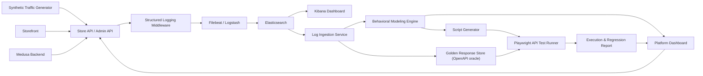

# Architecture

This document describes the components of the platform, the data contract between
each stage, and where the LLM is (and is not) used. It is the map; the per-phase
plans (`docs/phase-*-implementation-plan.md`) and ADRs (`docs/adr/`) are the
authoritative detail.

## System diagram

The entity-relationship diagram is in `docs/erd.mmd` (source) / `docs/erd.png` /
`docs/erd.svg`.

## Component responsibilities

| Component | Path | Responsibility |
| --- | --- | --- |
| **Medusa backend** | `apps/medusa/` | The system under test — a real Medusa v2 e-commerce backend exposing Store and Admin REST APIs over Postgres + Redis. |
| **Logging middleware** | `apps/medusa/apps/backend/src/api/` | Emits one structured JSON-line log per request: `trace_id`, `session_id`, `user_role` (from JWT `actor_type`), `event`, `method`, normalized `endpoint`, `status`, `duration_ms`. Bodies off by default; masks secrets. Shares `gate-contract.ts` with the golden overlay so enforcement and spec cannot drift. |
| **ELK (Filebeat/Logstash/Elasticsearch/Kibana)** | `infra/` | Ships Medusa stdout to Logstash, which parses the JSON, drops non-Medusa noise, and indexes into `behavior-logs-*`. Kibana is the human inspection surface. |
| **Traffic generator** | `services/traffic-generator/` | Drives synthetic guest/customer/admin/edge traffic at real Medusa APIs over a staged situation taxonomy. Attaches `session_id`/`trace_id` only — **never** a persona header. |
| **Log ingestion** | `services/log-ingestion/` | Queries Elasticsearch, groups by `session_id`, sorts by `timestamp`, normalizes dynamic URL segments, drops noise, and emits behavioral session-flow records + golden candidates. |
| **Behavior engine** | `services/behavior-engine/` | Mines the raw, unlabeled sequence stream (n-gram + PrefixSpan), derives emergent personas deterministically, dedups/clusters/ranks, applies the cross-run skip gate, and emits test candidates + the classification/holdout/control validation report. |
| **Golden library** | `services/golden/` | Builds the augmented OpenAPI spec (overlay of the middleware `401` gate onto the real Medusa OAS) and provides the schema-comparison oracle. The OAS — not logged bodies — is the authoritative assertion source (ADR 0001/0004). |
| **Script generator** | `services/script-generator/` | Turns ranked candidates into Playwright `.spec.ts` files: resolves IDs/tokens at runtime, adds status + golden assertions, and names each file by its canonical flow signature for idempotent regeneration (ADR 0002). |
| **Test runner** | `services/test-runner/` | Runs the generated suite per persona, normalizes Playwright JSON into a run result, and builds the JSON + self-contained HTML regression report with persona/flow/endpoint attribution. |
| **Storefront / dashboard** | `apps/storefront/`, `apps/platform-dashboard/` | Customer-facing UI and internal ops surface (status, links, future HITL review). |

## Data contracts between stages

Each stage consumes the previous stage's output and nothing else. The contract is
the file/shape passed across the boundary:

| From → To | Artifact | Shape | Spec |
| --- | --- | --- | --- |
| Middleware → ELK | log document | JSON line: `timestamp, trace_id, session_id, user_role, event, method, endpoint, status, duration_ms` (bodies only with `LOG_CAPTURE_BODIES=true`) | Phase 2, Phase 3, plan §7 |
| ELK → Ingestion | indexed log | `behavior-logs-*` documents | Phase 4 |
| Ingestion → Behavior engine | session flow | `{ session_id, steps: ["METHOD /normalized/endpoint", …], role_observed }` (no persona field) | Phase 6, plan §9 |
| Ingestion → Golden store | golden candidate | observed schema snapshot per `(endpoint, status)` | Phase 6/8, plan §11 |
| Behavior engine → Script generator | test candidate | `{ flow_name, persona, priority, source_sessions, steps:[{method, endpoint, expected_status}], flow_signature }` | Phase 7, plan §10.4 |
| Golden store → Script generator | golden response | `{ endpoint, expected_status, expected_schema, ignore_fields, schema_source, oas_* }` | Phase 8, plan §11.4 |
| Script generator → Test runner | Playwright spec | `generated-tests/<persona>/<sig>.spec.ts` | Phase 9 |
| Test runner → Reporting | run result | `reports/playwright/normalized.json` (persona→flow→step, expected/actual status, golden diff, source sessions) | Phase 10 |
| Reporting → consumer | report | `reports/report.json` + `reports/report.html` (totals, by_persona, by_flow, endpoint_failures) | Phase 11, plan §13 |

The **flow signature** (`signature.ts`, ADR 0002) is the stable identity that ties
a mined flow → its generated spec filename → the report's `by_flow` key, and
powers the cross-run skip gate. It is a persona-independent hash of the normalized
`METHOD endpoint` step sequence with consecutive duplicates collapsed.

## Where the LLM is — and is not — used

The pipeline is deterministic on every path that affects correctness. The LLM is
applied only where there is no deterministic ground truth (ADR 0001, plan §10.5):

| Use | Model | Stage |
| --- | --- | --- |
| LLM-varied traffic narratives | Haiku 4.5 (`claude-haiku-4-5-20251001`) | Traffic generation (Phase 5) |
| Flow naming, anomaly/contamination detection, assertion recommendation | Sonnet 4.6 (`claude-sonnet-4-6`, default; `BEHAVIOR_LLM_MODEL`-configurable to Opus 4.8) | Behavior engine (Phase 7) — advisory only |

The LLM is **never** used for: persona classification (deterministic from endpoint
content + status), the assertion oracle (the OpenAPI contract), the skip gate, or
the regression verdict. The optional agentic layer (ADR 0005, Phase 16) keeps the
same fence: agents propose (rank/triage/advise), deterministic code disposes
(verify/detect/gate); `AGENT_LAYER=off` is a no-op for correctness.

## Key architectural decisions (ADRs)

- **0001** — the OpenAPI contract, not logged bodies, is the assertion oracle.
- **0002** — a single canonical flow signature drives dedup, the skip gate, and spec naming.
- **0003** — order reversals are admin-only and state-gated; cart/checkout mutations are auth-gated (this is why a *successful* cart mutation is itself a customer signal).
- **0004** — the middleware `401` gate is overlaid onto the real Medusa OAS by a deterministic build step.
- **0005** — the agentic layer sits over the deterministic core, non-blocking and log-scoped.
- **0006** — the emergent auth signal extends to auth-gated reads.
