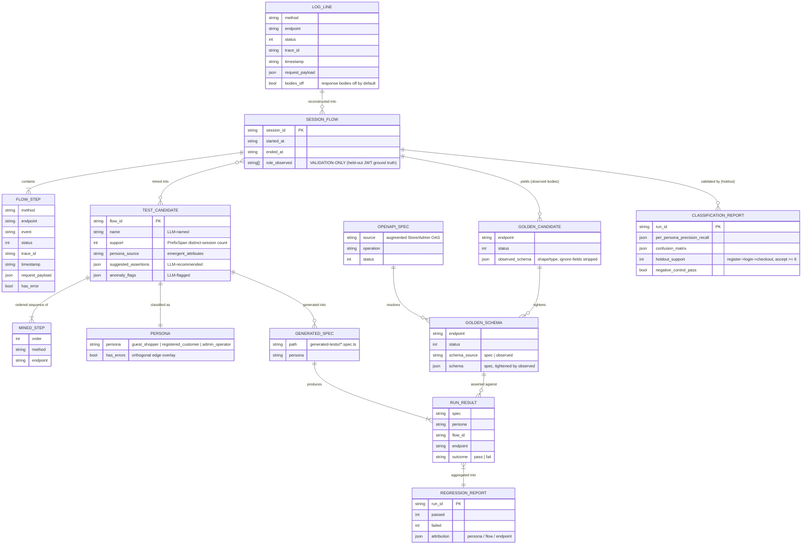

# Entity / data-flow diagram

The platform's "entities" are the durable artifacts passed between stages (each a
JSON file on disk), plus the records inside them. This ER diagram shows their
fields and relationships; the prose data contracts are in
[`architecture.md`](./architecture.md) and the run order in
[`pipeline.md`](./pipeline.md).

## Entity relationships

## Reading the diagram

- **`LOG_LINE` → `SESSION_FLOW`**: log-ingestion reconstructs per-session journeys
  from Elasticsearch by `trace_id` / session correlation.
- **`SESSION_FLOW` → `TEST_CANDIDATE`**: the behavior engine mines frequent
  subsequences (PrefixSpan, n-gram, Markov) across many sessions into ranked,
  deduplicated candidates — a many-to-many relationship (one session contributes to
  several candidates; one candidate is supported by many sessions).
- **`role_observed` is validation-only**: it is the held-out JWT ground truth.
  Mining and classification never read it; only `CLASSIFICATION_REPORT` does, and
  only *after* classification — the guardrail behind the measured persona accuracy.
- **`OPENAPI_SPEC` + `GOLDEN_CANDIDATE` → `GOLDEN_SCHEMA`**: the spec is
  authoritative on field existence; observed bodies only *tighten* under-specified
  spec leaves (ADR 0001 / ADR 0004). This is the assertion oracle.
- **`GENERATED_SPEC` + `GOLDEN_SCHEMA` → `RUN_RESULT` → `REGRESSION_REPORT`**: the
  runner executes each generated spec against Medusa and compares the response to
  its golden schema, aggregating into the red/green report with attribution.
